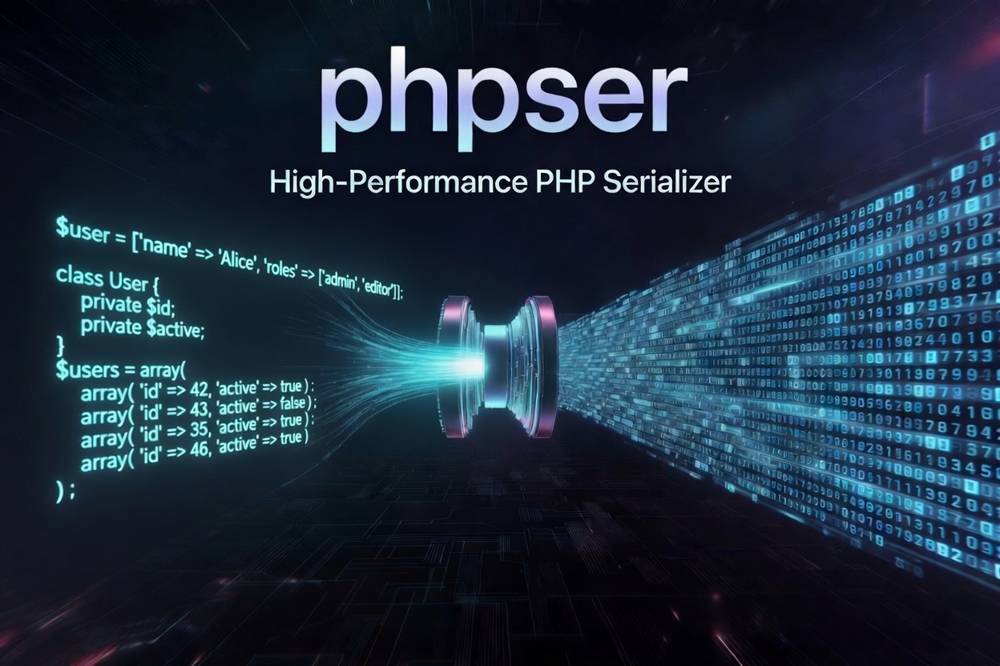

# phpser

[](https://github.com/iliaal/phpser/actions/workflows/tests.yml)
[](https://github.com/iliaal/phpser/releases)
[](https://opensource.org/licenses/BSD-3-Clause)
[](https://x.com/intent/follow?screen_name=iliaa)



A PHP serialization extension in C, targeting read-heavy cache workloads
where decode time matters more than encode time or payload size.

## Why phpser?

PHP cache workloads pay decode cost on every read. Encode happens once per write. The default `igbinary` was the right answer for over a decade, but leaves performance on the table for common cache shapes: database rowsets, packed numeric arrays, deep-nested structures, and same-class DTO batches (Laravel queue payloads, cached models).

phpser is decoder-optimized. It uses pointer-equality dict interning with a bounded content fallback, reuses decoded zend_strings by refcount, pre-sizes hash tables, writes straight into packed zval storage, and emits tagged scalar runs. On the current ARM benchmark, phpser beats igbinary on encode and decode in all nine cases. Packed numeric arrays decode 77-79% faster, deep nesting decodes 26% faster, and DTO batches decode 53-63% faster.

Rowsets keep the pointer-equality fast path for shared strings, while columnar encoding also deduplicates low-cardinality strings and equal packed-string vectors by content. In `rowset_distinct_1000`, where equal repeated strings have separate allocations, phpser is 53% smaller, 65% faster to encode, and 52% faster to decode than igbinary.

📖 **The design writeup:** [phpser: a fast, secure binary serializer for PHP cache workloads](https://ilia.ws/blog/phpser-a-fast-secure-binary-serializer-for-php-cache-workloads), on what the decoder does differently and why decode time is the metric to optimize. The [interactive benchmark page](https://iliaal.github.io/phpser/) compares phpser against igbinary, native `serialize()`, and msgpack across every cache shape.

## Install

```bash
# PIE (PHP Foundation's extension installer; uses the composer.json
# at the repo root with type: "php-ext")
pie install iliaal/phpser
```

On a minimal PHP image (e.g. `php:8.x-cli` from Docker Hub), PIE needs a
few build tools installed first:

```bash
# Debian/Ubuntu
sudo apt install -y git bison libtool-bin unzip

# macOS
brew install bison libtool
```

`unzip` is load-bearing on Debian: composer shells out to `/usr/bin/unzip`
when extracting PIE's prebuilt-binary zip. If `unzip` is missing, composer
silently falls back to PHP's ZipArchive which lays the `.so` out at a
path PIE doesn't check, and install fails with `ExtensionBinaryNotFound`
even though the zip downloaded fine.

### From source

```bash
git clone https://github.com/iliaal/phpser.git
cd phpser
phpize && ./configure --enable-phpser
make -j$(nproc)
sudo make install
echo 'extension=phpser.so' | sudo tee /etc/php/conf.d/phpser.ini
```

### Pre-built binaries

Pre-built `.dll`s for Windows (PHP 8.2-8.5, TS/NTS, x86 and x64) and `.so`s for
Linux glibc (x86_64, arm64) and macOS arm64 (PHP 8.4-8.5) are attached
to each [GitHub release](https://github.com/iliaal/phpser/releases). PIE
fetches the matching binary automatically; falls back to source-build
when no asset matches.

## Usage

Basic round-trip. The encoded payload is opaque bytes; treat it as a
binary blob in storage (no JSON-safety, no UTF-8 guarantees):

```php
$payload = phpser_serialize(['id' => 42, 'name' => 'row', 'tags' => ['a','b']]);
$value   = phpser_unserialize($payload);
// $value === ['id' => 42, 'name' => 'row', 'tags' => ['a','b']]
```

HMAC-signed mode for untrusted storage (memcached, redis, files,
cookies). The signed entry points wrap the payload in a constant-time
HMAC-SHA256 frame; tampered or foreign-keyed input is rejected before
any decoding work runs:

```php
$key = random_bytes(32);  // store this key in your app config; an empty key is rejected

$payload = phpser_serialize_signed($cacheValue, $key);
// ... later, possibly across a process boundary ...
$value = phpser_unserialize_signed($payload, $key);
// throws an Exception if the payload was tampered or signed with a different key,
// or if it verifies but the body then fails to decode (corruption, or a class it
// needs was removed since signing). A legitimately-signed null decodes to null.
```

`allowed_classes` option on both unserialize entry points. Same shape as
PHP's native `unserialize($payload, ['allowed_classes' => ...])`:

```php
// Reject all classes (decode them as __PHP_Incomplete_Class)
$value = phpser_unserialize($payload, ['allowed_classes' => false]);

// Allowlist specific classes; everything else becomes __PHP_Incomplete_Class
$value = phpser_unserialize($payload, ['allowed_classes' => [Foo::class, Bar::class]]);

// Allow all (default)
$value = phpser_unserialize($payload, ['allowed_classes' => true]);
$value = phpser_unserialize($payload);  // same as above
```

When decoding attacker-controlled bytes, use one of the two restricted
modes or the signed entry point. See `SECURITY.md` for the full threat
model.

## ✨ Features

- **Signed payloads for integrity.** `phpser_serialize_signed($value, $key)` wraps the payload in an HMAC-SHA256 frame; `phpser_unserialize_signed($payload, $key)` verifies in constant time and rejects tampered or foreign-keyed input *before* any decoding work runs. Use this whenever the storage layer crosses a trust boundary: memcached, redis, files, cookies, anywhere an attacker who can write to the store could otherwise feed a crafted payload to your decoder. An empty key is rejected on both sides. A keyless HMAC is forgeable, so callers must supply real key material.
- **Safe handling of untrusted input.** `allowed_classes` option on both unserialize entry points, matching PHP's native `unserialize($payload, ['allowed_classes' => ...])` shape: pass `false` to reject all classes, an array to allowlist specific ones, or `true` for the default. Disallowed classes decode as `__PHP_Incomplete_Class` with the original name preserved, never instantiated. Recursion depth is capped at 512 on both encode and decode (encode throws, decode returns `null`), and assoc decode uses bounded update semantics so duplicate-key payloads collapse to last-write-wins rather than phantom buckets. Wire-controlled keys run against a bounded collision budget, so a payload built around Zend's stable string hash cannot turn an array, property table, or rowset schema into quadratic decode work; a chain that exhausts the budget rejects the payload rather than grinding through it.
- **PHP 8.2+ (8.3, 8.4, 8.5, master).** BSD 3-Clause.

## Bench (PHP 8.4.23 aarch64, idle box, 1000 iters, median of 35)

| Shape | Size: ig → ps | Encode: ig → ps | Decode: ig → ps |
|---|---|---|---|
| rowset_100 | 4570 → **2727** (**-40%**) | 18.1k → **10.4k** ns (**-43%**) | 21.8k → **12.5k** ns (**-43%**) |
| rowset_1000 | 47K → **28K** (**-41%**) | 257.2k → **104.3k** ns (**-59%**) | 223.2k → **147.8k** ns (**-34%**) |
| rowset_distinct_1000 | 59K → **28K** (**-53%**) | 327.8k → **116.2k** ns (**-65%**) | 306.9k → **146.4k** ns (**-52%**) |
| packed_1k | 5495 → **1941** (**-65%**) | 9.7k → **2.4k** ns (**-75%**) | 16.2k → **3.5k** ns (**-79%**) |
| packed_10k | 59K → **22K** (**-63%**) | 94.4k → **34.0k** ns (**-64%**) | 162.1k → **37.4k** ns (**-77%**) |
| deep_50 | **419** → 424 (**+1%**) | 2.7k → **1.9k** ns (**-32%**) | 3.6k → **2.7k** ns (**-26%**) |
| dto_100 | 7083 → **5506** (**-22%**) | 28.4k → **24.7k** ns (**-13%**) | 56.2k → **26.4k** ns (**-53%**) |
| dto_1000 | 73K → **57K** (**-23%**) | 313.4k → **278.5k** ns (**-11%**) | 602.4k → **265.5k** ns (**-56%**) |
| dto_mixed | 22K → **14K** (**-34%**) | 107.9k → **86.8k** ns (**-20%**) | 237.5k → **88.0k** ns (**-63%**) |

phpser encodes 11-75% faster and decodes 26-79% faster than igbinary across
all nine cases. Packed numerics are about 64% smaller, 64-75% faster to encode,
and 77-79% faster to decode. Deep nesting is 32% faster to encode and 26%
faster to decode with a five-byte size difference.

The table's `rowset_100` and `rowset_1000` reuse PHP literal strings, so the
pointer-equality intern path remains the cheapest case. Columnar `TAG_TABLE`
also performs a bounded content-cardinality scan for separately allocated
strings and equal packed-string vectors. That makes `rowset_distinct_1000`
the same 27,928-byte payload as `rowset_1000`; against igbinary it is **53%
smaller, 65% faster to encode, and 52% faster to decode**.

DTO workloads (Laravel-queue-style payloads, single-class arrays) are now
**22-34% smaller, 53-63% faster to decode, 11-20% faster to encode** than
igbinary. Wire-v2 `TAG_OBJECT_SLOTS` drops the per-property key indices and
installs declared values straight into property slots; the dict dedups prop
names once, and the class-entry lookup cache amortizes `zend_lookup_class_ex`
across same-typed batches.

Sizes are byte-identical on x86 (the wire format is architecture-neutral);
the ns/op columns are from an idle aarch64 box, median of 35. For the full
four-way picture, phpser vs igbinary vs native `serialize()` vs msgpack,
with size, encode, and decode side by side on every shape, see the
**[interactive benchmark page](https://iliaal.github.io/phpser/)**.
Regenerate it with `php ... bench.php --html > docs/index.html`.

## Design highlights

The core ideas that drive the perf wins above:

- **Pointer-equality dict intern.** Encoding hits a `*zend_string == *zend_string`
  check first; only on miss do we hash the bytes. Cuts intern cost to
  near-zero for rowset-shaped data where PHP literals share interned
  zend_strings. Columnar rowsets additionally scan for at most eight distinct
  string values and prebind equal packed-string vectors, preserving dictionary
  reuse when database drivers return separate allocations for equal content.
- **Front-loaded string dictionary.** Same shape as igbinary's
  `compact_strings`, except we emit the table once at the head and
  reference by varint index from values. Trade-off: not streamable.
- **Refcount-reuse of zend_strings on decode.** Per-decode cache parallel
  to the dict. First reference allocates, subsequent ones `addref`.
- **HT_IS_PACKED detection via flag, not iteration.** Avoid scanning the
  buckets just to determine layout.
- **`arPacked` stride awareness.** PHP 8+'s packed-array layout stores
  zvals directly, not Buckets. Stride is 16, not 32.
- **Sparse-packed fallback.** Arrays with holes (post-`unset`) preserve
  original int keys via Assoc rather than silently re-indexing.

## Where phpser diverges from igbinary

igbinary is the closest reference point. The areas where there's still
measurable perf to take, and that this project targets, are:

1. **Pre-sized HT + direct `arPacked` writes on decode.** When the wire
   format declares `PACKED_LEN N`, allocate the HT once via
   `zend_new_array(N)` and write directly into `arPacked` with `ZVAL_*`
   macros. Skips N `zend_hash_next_index_insert` calls, including their
   hash computation, growth checks, and capacity tuning. **Shipped.**
2. **Tagged scalar runs.** `[1, 2, 3, ...]` (1000 longs) emits as a
   single `PACKED_LONGS` header + N zigzag varints, not 1000 `(tag,
   varint)` pairs. Decode is one tight loop with no per-element tag
   dispatch. **Shipped.**
3. **O(1) pointer-hash intern.** Open-addressed `zend_string* → slot`
   hash, grown without eviction. Hit rate near 100% on literal rowset shapes (PHP
   interns literals; the same `"id"` zend_string pointer flows through
   every row), and unique value strings (names, emails) hit a single-probe
   miss instead of a linear scan. Separately allocated low-cardinality table
   columns use a bounded content scan, which puts encode ahead of igbinary on
   every measured shape. Skips the byte-hash entirely on pointer hits.
   **Shipped.**
4. **Eager dict materialization with warm hashes.** All dict slots are
   resolved up front during header parse, against the engine's
   interned-string table first. Property names, class names, and hot
   literals come back as the engine's own interned strings (no
   allocation, no refcount traffic, pointer-equality hash lookups),
   with a regular allocation as the fallback. Hashes are set on both
   paths; `zend_hash_add_new` reuses the cached hash. **Shipped.**
5. **Invariant-gated `add_new` on assoc decode.** Wire-controlled duplicate
   keys must collapse to last-write-wins rather than produce phantom buckets
   (`count($arr) != count(array_unique(array_keys($arr)))`), and canonical
   integer strings must coerce to integer keys. Authentication proves key
   possession, not that the bytes came from phpser's encoder: a key holder can
   sign a handcrafted frame. `TAG_ASSOC` therefore always uses update
   semantics; schema-based paths use `add_new` only after validating distinct,
   non-numeric keys once at schema read. **Shipped.**
6. **Inline-short-string tag with upgrade-on-second-encounter.**
   `TAG_STR_INLINE` (0x0c) and `KEY_STR_INLINE` (0x02) are emitted on a
   string's first occurrence; the next occurrence triggers an in-place
   upgrade to a dict entry, and all subsequent ones emit `TAG_STR_DICT`.
   Singletons (e.g. `row_X` values in a rowset) never hit the upgrade
   branch. They cost nothing in the dict header. The intern cache
   doubles as the "seen once?" signal: high bit of `idx` distinguishes
   `INLINE_EMITTED` from `DICT_IDX`. No pre-pass; single walk of the
   zval tree as before.

   A count-then-emit variant was tried first: pre-walk the zval tree
   to tag occurrences, then emit inline for singletons and dict for
   repeats. The pre-pass cost ~200 ns per string and ate the
   per-singleton savings, so the single-walk upgrade-on-second-encounter
   version above is what ships. That step moved `rowset_1000` encode to
   25% faster than igbinary (up from 8% in the pre-upgrade implementation);
   the later columnar `TAG_TABLE` format took rowsets further still, to
   -41% size and -59% encode versus igbinary.
7. **Skip refcount machinery during build.** All zvals built during decode
   are fresh and unshared until handed back to PHP. Internal writes can
   skip `Z_TRY_ADDREF` guards.

## Local dev build

The hand-rolled `Makefile` builds against an in-tree `~/php-src-8.4-opt`
checkout without `phpize`/`autoconf`. Useful for hacking on the extension
while also hacking on PHP itself:

```sh
make -j$(nproc)           # builds modules/phpser.so
make test                 # runs tests/*.phpt via run-tests.php
```

Override `PHP_SRC=` to target a different in-tree PHP checkout. Load
alongside igbinary for the A/B bench:

```sh
~/php-src-8.4-opt/sapi/cli/php \
  -d extension=$HOME/igbinary/modules/igbinary.so \
  -d extension=$(pwd)/modules/phpser.so \
  bench.php
```

The `config.m4` auto-detects the session extension and registers phpser
as a `session.serialize_handler` when available.

## Limitations / known gaps

- **Recursion depth is capped at 512** on both encode and decode. On decode,
  anything deeper than 512 nested containers / refs is rejected (returns
  `null`) to bound stack consumption against adversarial wire payloads. On
  encode, input deeper than 512 throws an `Exception` rather than silently
  shipping a truncated payload. Object cycles are
  preserved correctly via the id-table machinery and don't count against
  this cap for shared-graph cases; the cap only fires on genuinely deep
  trees. Cache workloads typically nest 5-10 deep, so the cap is many
  orders of magnitude past any legitimate payload.
- **Closures and resources encode as `NULL`.** This behavior differs from
  native `serialize()` by design: PHP throws when serializing a `Closure` and
  serializes a resource as its numeric resource id. phpser treats both as
  unsupported cache values and writes `NULL`.
- **Unknown classes at decode fall back to `stdClass`** for plain objects
  and `__serialize`-based objects, rather than PHP's `__PHP_Incomplete_Class`.
  This is deliberate for the typical cache workload; `allowed_classes => [...]`
  produces `__PHP_Incomplete_Class` with the original name preserved for
  disallowed classes, matching PHP. The fallback does **not** apply to every
  wire shape: a positional DTO (`TAG_OBJECT_SLOTS`) or an enum (`TAG_ENUM`)
  whose class no longer exists fails the whole decode (returns `null`) because
  slots carry only values and have no schema to decode into. A legacy
  `Serializable` value (`TAG_OBJECT_LEGACY`) whose class is gone decodes as
  `null` in place. Evolve classes append-only if
  cached payloads must outlive a schema change. When a positional DTO is
  disallowed and its class is not already loaded, phpser does not autoload it
  for the sole purpose of recovering property names. The incomplete object
  keeps its original class marker but discards its unnamed slot values.
- **Enum cases are filtered by `allowed_classes`.** Native `unserialize()` does
  not consult the allowlist on its enum path, so a serialized enum is always
  resurrected there. phpser applies the filter: a disallowed enum decodes to
  `__PHP_Incomplete_Class`. Enum cases are inert singletons, so the security
  delta is small, but list their class names in the allowlist if you rely on
  enums round-tripping through a filtered decode.
- **Strings and blobs are capped at 4 GiB (`UINT32_MAX`) on the wire.**
  Encoding a longer value fails loud (throws for the userland API, an
  `E_WARNING` for the session handler) rather than emitting bytes the decoder
  would reject. No single cache value realistically approaches this.
- **Wire integers outside the target `zend_long` range are rejected on 32-bit
  builds.** A payload written by a 64-bit process can carry values a 32-bit
  `zend_long` cannot hold. Decode returns `null` instead of narrowing them, so
  a cache shared between 32-bit and 64-bit processes has to stay inside the
  32-bit range. This covers scalars, packed runs, table columns, and array
  keys; encoding is unaffected.
- **`TAG_OBJECT_SLOTS` is positional.** Eligible typed objects encode their
  declared properties as values in `properties_info_table` (declaration)
  order with no per-property names; decode installs them back in that order.
  An older payload carrying a prefix of the current effective slot table is
  accepted and appended properties retain their class defaults. A
  payload with more slots than the current class is rejected. **Nothing else
  is detectable.** The decoder cannot tell an append-at-end from an insertion
  or a reorder, so any other schema change silently lands values in the wrong
  slots, including a change that alters the slot count. Inserting `$mid`
  between `$a` and `$b`, for example, decodes an old two-slot payload as
  `a=1, mid=2, b=<default>` with no error. Type declarations catch only the
  subset of mismatches that fail a coercion.
  For payloads that outlive a deploy, append properties only at the end of the
  effective `properties_info_table` order. Adding a parent property can insert
  before child slots and break append-only order.
- **`session.serialize_handler=phpser` is shipped** (compiled in when
  `phpize` detects the session extension; gated on `HAVE_PHP_SESSION` so
  the extension still loads on session-less PHP builds). `phpredis`
  integration is not yet wired; call `phpser_serialize`/`unserialize`
  directly when using the extension as a phpredis serializer. The handler
  serializes `$_SESSION` as a single phpser array value; it is **not**
  byte-compatible with the built-in `php`, `php_binary`, or `igbinary`
  session formats, so switching handlers doesn't read back sessions written
  by another. It also decodes with all classes allowed and magic methods
  enabled: treat the session store as trusted, exactly as with the native
  `php_serialize` handler. If session encode fails, the callback returns
  failure and emits a warning, but PHP's session core may persist an empty
  payload in place of the previous session; it does not preserve the old bytes
  on failure.

## Wire format (V1 / V2)

```
[u8 version=0x01 or 0x02]
[varint ndict]
  per entry: [varint len] [bytes]
[value]

value tags:
  0x00 NULL
  0x01 FALSE
  0x02 TRUE
  0x03 LONG            varint (zigzag-encoded)
  0x04 DOUBLE          8 bytes (LE)
  0x05 STR_DICT        varint dict_idx
  0x06 ASSOC           varint(len), N×(key, val)
  0x07 PACKED_MIXED    varint(len), N×val
  0x08 PACKED_LONGS    varint(len), N×zigzag-varint
  0x09 PACKED_DOUBLES  varint(len), N×8-byte LE
  0x0a OBJECT          varint(class_idx), varint(nprops), N×(key_idx, val)
  0x0b PACKED_STRINGS  varint(len), N×varint(dict_idx)  // typed string run
  0x0c STR_INLINE      varint(len), bytes  // single-use string, skips dict
  0x0d ENUM            varint(class_idx), varint(case_name_idx)
  0x0e OBJECT_MAGIC    varint(class_idx), value  // class with __serialize;
                       // value is the array __serialize returned
  0x0f OBJECT_LEGACY   varint(class_idx), varint(len), bytes  // class with
                       // ce->serialize / ce->unserialize (Serializable etc.)
  0x10 REF             varint(id)  // back-ref to a previously-emitted container
  0x11 NEW_REF         value  // claims the next id for an IS_REFERENCE wrap
  0x12 OBJECT_SLOTS    varint(class_idx), varint(nprops), N×val  // wire v2 only;
                       declared-property values in properties_info_table order, no
                       per-prop key index. Emitted when every declared slot is
                       initialized; otherwise keyed OBJECT (0x0a) is used.
  0x13 ASSOC_DICT      varint(n), N×varint(dict_key_idx), N×val  // wire v2 only;
                       assoc with all string keys dict-bound; skips KEY_STR tags.
  0x14 ROWSET          varint(nrows), varint(ncols), N×varint(dict_key_idx),
                       nrows×ncols×val  // wire v2 only; packed homogeneous assoc
                       rows (rowset shape). Schema once, values row-major.
  0x15 TABLE           varint(nrows), varint(ncols), N×varint(dict_key_idx),
                       ncols×(col_tag, payload)  // wire v2 only; columnar rowset.
                       col_tag is PACKED_LONGS/DOUBLES/STRINGS/MIXED/DELTA; nrows implicit.
  0x16 PACKED_DELTA    varint(len), zigzag(v0), (len-1)×zigzag(delta)  // wire v2 only;
                       integer run as consecutive differences, wrapping mod 2^64.
                       Also a TABLE col_tag (column form has no len varint).
  0x17 PACKED_AFFINE   varint(len), zigzag(base), zigzag(step)  // wire v2 only;
                       v[i] = base + i*step mod 2^64 (ranges, constant fills).
                       Standalone only, never a TABLE column; both sides enforce
                       a shared 1M-element budget (see SECURITY.md).

key tags:
  0x00 LONG            varint(zigzag)
  0x01 STR             varint(dict_idx)
  0x02 STR_INLINE      varint(len), bytes
```

Varints are LEB128 (unsigned); signed values use zigzag encoding. Tags
0x10/0x11 plus 0x0a/0x0d/0x0e/0x0f/0x12 each claim the next id in encounter
order, so the decoder reconstructs back-refs by counting
container tags as it parses.

The version byte is emitted as `0x02` only when the body actually uses a
v2-only tag (`0x12`–`0x17`); otherwise it stays `0x01`. On decode it is a
*minimum-reader* signal, not a gate: the tag dispatch is version-agnostic,
so a hand-built frame carrying a v2 tag under a `0x01` header still decodes.
This tolerance keeps the version byte additive. Don't rely on it alone to
reject a future format; a
backwards-incompatible change gets a new version constant *and* explicit tag
rejection.

## 🔗 Native PHP extensions

Companion native PHP extensions:

- **[php_excel](https://github.com/iliaal/php_excel)**: native Excel I/O via LibXL. 7-10× faster than PhpSpreadsheet, full XLS/XLSX with formulas, formatting, and styling.
- **[mdparser](https://github.com/iliaal/mdparser)**: native CommonMark + GFM markdown parser via md4c. 15-30× faster than pure-PHP libraries.
- **[php_clickhouse](https://github.com/iliaal/php_clickhouse)**: native ClickHouse client speaking the wire protocol directly. Picks up where SeasClick left off.
- **[pdo_duckdb](https://github.com/iliaal/pdo_duckdb)**: PDO driver for DuckDB, analytical SQL in your PHP stack.
- **[fastjson](https://github.com/iliaal/fastjson)**: drop-in faster `ext/json`, backed by yyjson. 6× encode, 2.7× decode, 5× validate.
- **[fast_uuid](https://github.com/iliaal/fast_uuid)**: high-throughput UUID generation (v1/v4/v7), batched CSPRNG and SIMD hex formatter, ramsey-compatible API.
- **[fastchart](https://github.com/iliaal/fastchart)**: native chart-rendering extension. 38 chart types behind one fluent OO API, SVG-canonical with PNG/JPG/WebP and optional PDF output.
- **[statgrab](https://github.com/iliaal/statgrab)**: system statistics (CPU, memory, disk, network) via libstatgrab, no parsing /proc by hand.
- **[phonetic](https://github.com/iliaal/phonetic)**: native phonetic name matching (Double Metaphone, Beider-Morse, Daitch-Mokotoff, NYSIIS, Match Rating), the encoders PHP core lacks.

---

[Follow on X](https://x.com/iliaa) • [Read the writeup](https://ilia.ws/blog/phpser-a-fast-secure-binary-serializer-for-php-cache-workloads) • If this cut your cache decode CPU, ⭐ star it!
