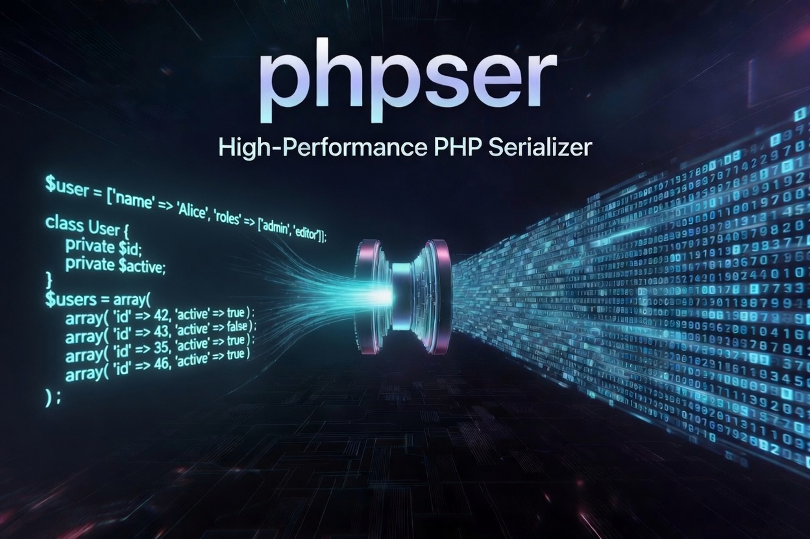

# phpser

[](https://github.com/iliaal/phpser/actions/workflows/tests.yml)
[](https://github.com/iliaal/phpser/releases)
[](https://opensource.org/licenses/BSD-3-Clause)
[](https://x.com/intent/follow?screen_name=iliaa)



A PHP serialization extension in C, targeting read-heavy cache workloads
where decode time matters more than encode time or payload size.

## Why phpser?

PHP cache workloads pay decode cost on every read and encode cost once per write. `igbinary` has been the default for over a decade, but it leaves performance on the table for common cache shapes: database rowsets, packed numeric arrays, deep-nested structures, and same-class DTO batches (Laravel queue payloads, cached models).

phpser optimizes for decode. It uses pointer-equality dict interning with a bounded content fallback, reuses decoded zend_strings by refcount, pre-sizes hash tables, writes straight into packed zval storage, and emits tagged scalar runs. On the current ARM benchmark, phpser beats igbinary on encode and decode in all ten cases. Integer ranges collapse to constant-size affine runs and decode 91-92% faster, shuffled integer arrays decode 78% faster, deep nesting decodes 26% faster, and DTO batches decode 62-65% faster.

Rowsets keep the pointer-equality fast path for shared strings, while columnar encoding also deduplicates low-cardinality strings and equal packed-string vectors by content. In `rowset_distinct_1000`, where equal repeated strings have separate allocations, phpser is 56% smaller, 63% faster to encode, and 53% faster to decode than igbinary.

📖 Design writeup: [phpser: a fast, secure binary serializer for PHP cache workloads](https://ilia.ws/blog/phpser-a-fast-secure-binary-serializer-for-php-cache-workloads) covers what the decoder does differently and why decode time is the metric to optimize. The [interactive benchmark page](https://iliaal.github.io/phpser/) compares phpser against igbinary, native `serialize()`, and msgpack across every cache shape.

## Install

```bash
# PIE (PHP Foundation's extension installer; uses the composer.json
# at the repo root with type: "php-ext")
pie install iliaal/phpser
```

On a minimal PHP image (e.g. `php:8.x-cli` from Docker Hub), PIE needs a
few build tools installed first:

```bash
# Debian/Ubuntu
sudo apt install -y git bison libtool-bin unzip

# macOS
brew install bison libtool
```

Install `unzip` on Debian. Composer shells out to `/usr/bin/unzip` to
extract PIE's prebuilt-binary zip. Without it, composer silently falls back
to PHP's ZipArchive, which puts the `.so` at a path PIE doesn't check, and
install fails with `ExtensionBinaryNotFound` even though the download
succeeded.

### From source

```bash
git clone https://github.com/iliaal/phpser.git
cd phpser
phpize && ./configure --enable-phpser
make -j$(nproc)
sudo make install
echo 'extension=phpser.so' | sudo tee /etc/php/conf.d/phpser.ini
```

### Pre-built binaries

Pre-built `.dll`s for Windows (PHP 8.2-8.5, TS/NTS, x86 and x64) and `.so`s for
Linux glibc (x86_64, arm64) and macOS arm64 (PHP 8.4-8.5) are attached
to each [GitHub release](https://github.com/iliaal/phpser/releases). PIE
fetches the matching binary automatically and builds from source when no
asset matches.

## Usage

Basic round-trip. The encoded payload is opaque bytes; treat it as a
binary blob in storage (no JSON-safety, no UTF-8 guarantees):

```php
$payload = phpser_serialize(['id' => 42, 'name' => 'row', 'tags' => ['a','b']]);
$value   = phpser_unserialize($payload);
// $value === ['id' => 42, 'name' => 'row', 'tags' => ['a','b']]
```

HMAC-signed mode for untrusted storage (memcached, redis, files,
cookies). The signed entry points wrap the payload in a constant-time
HMAC-SHA256 frame; tampered or foreign-keyed input is rejected before
any decoding work runs:

```php
$key = random_bytes(32);  // store this key in your app config; an empty key is rejected

$payload = phpser_serialize_signed($cacheValue, $key);
// ... later, possibly across a process boundary ...
$value = phpser_unserialize_signed($payload, $key);
// throws an Exception if the payload was tampered or signed with a different key,
// or if it verifies but the body then fails to decode (corruption, or a class it
// needs was removed since signing). A legitimately-signed null decodes to null.
```

`allowed_classes` option on both unserialize entry points. Same shape as
PHP's native `unserialize($payload, ['allowed_classes' => ...])`:

```php
// Reject all classes (decode them as __PHP_Incomplete_Class)
$value = phpser_unserialize($payload, ['allowed_classes' => false]);

// Allowlist specific classes; everything else becomes __PHP_Incomplete_Class
$value = phpser_unserialize($payload, ['allowed_classes' => [Foo::class, Bar::class]]);

// Allow all (default)
$value = phpser_unserialize($payload, ['allowed_classes' => true]);
$value = phpser_unserialize($payload);  // same as above
```

When decoding attacker-controlled bytes, use one of the two restricted
modes or the signed entry point. See `SECURITY.md` for the full threat
model.

## ✨ Features

- **Signed payloads**: `phpser_serialize_signed($value, $key)` wraps the payload in an HMAC-SHA256 frame; `phpser_unserialize_signed($payload, $key)` verifies in constant time and rejects tampered or foreign-keyed input before any decoding runs. Use it whenever the store crosses a trust boundary (memcached, redis, files, cookies), anywhere an attacker who can write to the store could feed your decoder a crafted payload. Both sides reject an empty key, since a keyless HMAC is forgeable.
- **Untrusted input limits**: both unserialize entry points take `allowed_classes` in the same shape as native `unserialize()`: `false` rejects all classes, an array allowlists specific ones, `true` is the default. Disallowed classes decode as `__PHP_Incomplete_Class` with the original name preserved and are never instantiated. Recursion depth is capped at 512 on encode (throws) and decode (returns `null`). Duplicate assoc keys collapse to last-write-wins instead of phantom buckets. Wire-controlled keys run against a bounded collision budget, so a payload built around Zend's stable string hash cannot make an array, property table, or rowset schema quadratic to decode; exhausting the budget rejects the payload.
- **Supported versions**: PHP 8.2+ (8.3, 8.4, 8.5, master). BSD 3-Clause.

## Bench (PHP 8.4.25 aarch64, idle box, 1000 iters, median of 35)

| Shape | Size: ig → ps | Encode: ig → ps | Decode: ig → ps |
|---|---|---|---|
| rowset_100 | 4570 → **2287** (**-50%**) | 18.2k → **9.9k** ns (**-45%**) | 21.9k → **9.3k** ns (**-57%**) |
| rowset_1000 | 47K → **23K** (**-52%**) | 256.5k → **100.1k** ns (**-61%**) | 219.7k → **102.2k** ns (**-53%**) |
| rowset_distinct_1000 | 59K → **26K** (**-56%**) | 328.5k → **120.6k** ns (**-63%**) | 310.2k → **147.1k** ns (**-53%**) |
| packed_1k | 5495 → **7** (**-99.9%**) | 9.6k → **1.5k** ns (**-84%**) | 16.2k → **1.4k** ns (**-91%**) |
| packed_10k | 59K → **7** (**-99.9%**) | 93.1k → **14.3k** ns (**-85%**) | 161.4k → **12.6k** ns (**-92%**) |
| packed_rand_10k | 78K → **30K** (**-62%**) | 104.4k → **71.0k** ns (**-32%**) | 182.6k → **39.6k** ns (**-78%**) |
| deep_50 | **419** → 425 (**+1%**) | 2.7k → **1.9k** ns (**-29%**) | 3.6k → **2.7k** ns (**-26%**) |
| dto_100 | 7083 → **5186** (**-27%**) | 28.1k → **22.6k** ns (**-20%**) | 55.8k → **21.5k** ns (**-62%**) |
| dto_1000 | 73K → **54K** (**-27%**) | 314.7k → **256.4k** ns (**-19%**) | 620.7k → **215.1k** ns (**-65%**) |
| dto_mixed | 22K → **14K** (**-34%**) | 109.2k → **86.8k** ns (**-20%**) | 231.6k → **82.3k** ns (**-64%**) |

phpser encodes 19-85% faster and decodes 26-92% faster than igbinary across
all ten cases. Integer ranges collapse to a 7-byte affine run and decode
91-92% faster; shuffled integers (`packed_rand_10k`) are 62% smaller, 32%
faster to encode, and 78% faster to decode. Deep nesting is 29% faster to
encode and 26% faster to decode with a six-byte size difference.

The table's `rowset_100` and `rowset_1000` reuse PHP literal strings, so the
pointer-equality intern path remains the cheapest case, and every row shares
one literal `tags` array, which phpser encodes once and shares by refcount on
decode. Columnar `TAG_TABLE` also performs a bounded content-cardinality scan
for separately allocated strings and equal packed-string vectors, so
`rowset_distinct_1000` (distinct string and `tags` allocations on every row)
is **56% smaller, 63% faster to encode, and 53% faster to decode** than
igbinary.

DTO workloads (Laravel-queue-style payloads, single-class arrays) are
**27-34% smaller, 62-65% faster to decode, 19-20% faster to encode** than
igbinary. Wire-v2 `TAG_OBJECT_SLOTS` drops the per-property key indices and
installs declared values straight into property slots; the dict dedups prop
names once, and the class-entry lookup cache amortizes `zend_lookup_class_ex`
across same-typed batches.

`bench.php --extended` adds single values, wrapped envelopes, signed payloads,
collector-on retained decode, and Laravel-app shapes (Eloquent models whose
`attributes` and `original` share one array, a document wallet, a queue job,
a catalog, JWKS). Run it with `-d opcache.enable_cli=1` for the opcache
configuration.

Sizes are byte-identical on x86 (the wire format is architecture-neutral);
the ns/op columns are from an idle aarch64 box, median of 35. For the full
four-way picture, phpser vs igbinary vs native `serialize()` vs msgpack,
with size, encode, and decode side by side on every shape, see the
**[interactive benchmark page](https://iliaal.github.io/phpser/)**.
Regenerate it with `php ... bench.php --html > docs/index.html`.

## Design highlights

- **Pointer-equality dict intern**: encoding checks `*zend_string == *zend_string`
  first and hashes the bytes only on a miss. Intern cost is near zero for
  rowset-shaped data where PHP literals share interned
  zend_strings. Columnar rowsets additionally scan for at most eight distinct
  string values and prebind equal packed-string vectors, preserving dictionary
  reuse when database drivers return separate allocations for equal content.
- **Front-loaded string dictionary**: same shape as igbinary's
  `compact_strings`, except phpser emits the table once at the head and
  reference by varint index from values. Trade-off: not streamable.
- **Integer-run compression**: constant-stride runs (ranges, constant
  fills) collapse to a base+step affine tag a few bytes long, bounded by a
  one-million-element budget the encoder and decoder enforce identically.
  Other integer runs and rowset id columns store zigzag deltas whenever
  those encode smaller; wrapping mod-2^64 arithmetic keeps every int64
  sequence exact with no overflow checks.
- **Refcount reuse of zend_strings on decode**: a per-decode cache parallels
  the dict. The first reference allocates; later ones `addref`.
- **Shared arrays stay shared**: a nested array held in several places (a
  literal list on every row, an Eloquent model's `attributes` and `original`)
  is encoded once and decoded as one refcounted table, so decoded memory
  matches the source instead of multiplying.
- **GC-quiet decode**: a clean decode adds one garbage-collector root for the
  result instead of one per decoded object, so large object graphs don't
  trigger collector runs while the application holds them.
- **Hardware HMAC**: signed payloads use ARMv8 Crypto Extensions or SHA-NI
  when available and cache the per-key HMAC state. `php --ri phpser` shows
  the backend in use (`armv8`, `sha-ni`, or `ext/hash` with the reason).
- **HT_IS_PACKED flag check**: layout comes from the flag, without
  scanning buckets.
- **`arPacked` stride awareness**: PHP 8+ packed arrays store zvals
  directly, not Buckets, so the stride is 16, not 32.
- **Sparse-packed fallback**: arrays with holes (post-`unset`) preserve
  original int keys via Assoc rather than silently re-indexing.

## Where phpser diverges from igbinary

igbinary is the closest reference point. phpser takes measurable
performance in these areas, all shipped:

1. **Pre-sized HT + direct `arPacked` writes on decode.** When the wire
   format declares `PACKED_LEN N`, allocate the HT once via
   `zend_new_array(N)` and write directly into `arPacked` with `ZVAL_*`
   macros. Skips N `zend_hash_next_index_insert` calls, including their
   hash computation, growth checks, and capacity tuning.
2. **Tagged scalar runs.** `[1, 2, 3, ...]` (1000 longs) emits as a
   single `PACKED_LONGS` header + N zigzag varints, not 1000 `(tag,
   varint)` pairs. Decode is one tight loop with no per-element tag
   dispatch.
3. **O(1) pointer-hash intern.** Open-addressed `zend_string* → slot`
   hash, grown without eviction. Hit rate near 100% on literal rowset shapes (PHP
   interns literals; the same `"id"` zend_string pointer flows through
   every row), and unique value strings (names, emails) hit a single-probe
   miss instead of a linear scan. Separately allocated low-cardinality table
   columns use a bounded content scan, which puts encode ahead of igbinary on
   every measured shape. Pointer hits skip the byte-hash entirely.
4. **Eager dict materialization with warm hashes.** All dict slots are
   resolved up front during header parse, against the engine's
   interned-string table first. Property names, class names, and hot
   literals come back as the engine's own interned strings (no
   allocation, no refcount traffic, pointer-equality hash lookups),
   with a regular allocation as the fallback. Hashes are set on both
   paths; `zend_hash_add_new` reuses the cached hash.
5. **Invariant-gated `add_new` on assoc decode.** Wire-controlled duplicate
   keys must collapse to last-write-wins rather than produce phantom buckets
   (`count($arr) != count(array_unique(array_keys($arr)))`), and canonical
   integer strings must coerce to integer keys. Authentication proves key
   possession, not that the bytes came from phpser's encoder: a key holder can
   sign a handcrafted frame. `TAG_ASSOC` therefore always uses update
   semantics; schema-based paths use `add_new` only after validating distinct,
   non-numeric keys once at schema read.
6. **Inline-short-string tag with upgrade-on-second-encounter.**
   `TAG_STR_INLINE` (0x0c) and `KEY_STR_INLINE` (0x02) are emitted on a
   string's first occurrence; the next occurrence triggers an in-place
   upgrade to a dict entry, and all subsequent ones emit `TAG_STR_DICT`.
   Singletons (e.g. `row_X` values in a rowset) never hit the upgrade
   branch. They cost nothing in the dict header. The intern cache
   doubles as the "seen once?" signal: high bit of `idx` distinguishes
   `INLINE_EMITTED` from `DICT_IDX`. No pre-pass; single walk of the
   zval tree as before.

   A count-then-emit pre-pass (tag occurrences first, then emit inline
   for singletons and dict for repeats) cost ~200 ns per string and ate
   the per-singleton savings. The single-walk upgrade moved `rowset_1000`
   encode from 8% to 25% faster than igbinary; the later columnar
   `TAG_TABLE` format and delta id columns reached -45% size and -58%
   encode versus igbinary.
7. **Skip refcount machinery during build.** All zvals built during decode
   are fresh and unshared until handed back to PHP. Internal writes can
   skip `Z_TRY_ADDREF` guards.

## Local dev build

The hand-rolled `Makefile` builds against an in-tree `~/php-src-8.4-opt`
checkout without `phpize`/`autoconf`, for working on the extension and PHP
at the same time:

```sh
make -j$(nproc)           # builds modules/phpser.so
make test                 # runs tests/*.phpt via run-tests.php
```

Override `PHP_SRC=` to target a different in-tree PHP checkout. Load
alongside igbinary for the A/B bench:

```sh
~/php-src-8.4-opt/sapi/cli/php \
  -d extension=$HOME/igbinary/modules/igbinary.so \
  -d extension=$(pwd)/modules/phpser.so \
  bench.php
```

The `config.m4` auto-detects the session extension and registers phpser
as a `session.serialize_handler` when available.

## Limitations / known gaps

- **The three entry points signal corrupt input differently.** `phpser_unserialize()`
  silently returns `null` on malformed, truncated, or over-deep input,
  indistinguishable from a successfully decoded `null`. Trailing bytes after
  a complete top-level value are tolerated on this path (prefix read).
  `phpser_unserialize_signed()` throws instead (since 0.4.0), so a
  legitimately-signed `null` still decodes cleanly, and both the signed and
  session paths require exact consumption of the frame. The session handler
  reports decode failure to the engine (warning; a scalar-root payload fails
  the read rather than becoming an empty session). When a cache miss must be
  told apart from a cached `null`, use the signed entry point. `SECURITY.md`
  carries the full contract.
- **Recursion depth is capped at 512** on both encode and decode. On decode,
  anything deeper than 512 nested containers / refs is rejected (returns
  `null`) to bound stack consumption against adversarial wire payloads. On
  encode, input deeper than 512 throws an `Exception` rather than silently
  shipping a truncated payload. Object cycles go through the id table and
  don't count against the cap; only genuinely deep trees hit it. Cache
  workloads typically nest 5-10 deep.
- **Closures, other non-serializable objects, and resources encode as
  `NULL`.** Native `serialize()` throws for `Closure`, `Generator`, `Fiber`,
  and other classes marked not serializable, and writes every resource as
  `i:0;`, so native `unserialize()` returns `int(0)` where phpser returns
  `NULL`. Neither serializer stores the resource id or can restore an open
  stream or other resource handle. phpser treats all of these as unsupported
  cache values and writes `NULL`.
- **Unknown classes at decode become `__PHP_Incomplete_Class`** with the
  original name preserved, matching PHP native `unserialize()`. This holds
  for plain objects and `__serialize`-based objects, and for any shape whose
  class the `allowed_classes` filter denies. Two wire shapes differ when the
  class is merely absent (rather than denied): a legacy `Serializable`
  value (`TAG_OBJECT_LEGACY`) whose class is gone decodes as `null` in
  place, and an enum (`TAG_ENUM`) whose class is gone fails the whole
  decode, because neither carries a property schema to install into. The
  positional DTO (`TAG_OBJECT_SLOTS`) decodes to an incomplete object that
  still claims its id for later back-refs; when its class is already loaded
  the values are installed onto the incomplete, and only when the class is
  unavailable are the unnamed slot values dropped (phpser does not autoload
  a class for the sole purpose of recovering property names). Evolve classes
  append-only if cached payloads must outlive a schema change.
- **Enum cases are filtered by `allowed_classes`.** Native `unserialize()` does
  not consult the allowlist on its enum path, so a serialized enum is always
  resurrected there. phpser applies the filter: a disallowed enum decodes to
  `__PHP_Incomplete_Class`. Enum cases are inert singletons, so the security
  delta is small, but list their class names in the allowlist if you rely on
  enums round-tripping through a filtered decode.
- **Strings and blobs are capped at 4 GiB (`UINT32_MAX`) on the wire.**
  Encoding a longer value fails loud (throws for the userland API, an
  `E_WARNING` for the session handler) rather than emitting bytes the decoder
  would reject. No single cache value realistically approaches this.
- **Encode memory is O(distinct strings), uncapped.** The encoder interns
  every distinct string it emits into a cache that grows without eviction
  for the duration of the call (pre-sized from the top-level value, so the
  common shapes never regrow mid-encode). A value with N unique strings
  holds N entries until the encode returns; nothing is retained between
  calls. Unusually string-diverse values cost temporary memory proportional
  to their diversity; chunk the value if that matters.
- **Wire integers outside the target `zend_long` range are rejected on 32-bit
  builds.** A payload written by a 64-bit process can carry values a 32-bit
  `zend_long` cannot hold. Decode returns `null` instead of narrowing them, so
  a cache shared between 32-bit and 64-bit processes has to stay inside the
  32-bit range. This covers scalars, packed runs, table columns, and array
  keys; encoding is unaffected.
- **`TAG_OBJECT_SLOTS` is positional.** Eligible typed objects encode their
  declared properties as values in `properties_info_table` (declaration)
  order with no per-property names; decode installs them back in that order.
  An older payload carrying a prefix of the current effective slot table is
  accepted and appended properties retain their class defaults. A
  payload with more slots than the current class is rejected. **Nothing else
  is detectable.** The decoder cannot tell an append-at-end from an insertion
  or a reorder, so any other schema change silently lands values in the wrong
  slots, including a change that alters the slot count. Inserting `$mid`
  between `$a` and `$b`, for example, decodes an old two-slot payload as
  `a=1, mid=2, b=<default>` with no error. Type declarations catch only the
  subset of mismatches that fail a coercion.
  For payloads that outlive a deploy, append properties only at the end of the
  effective `properties_info_table` order. Adding a parent property can insert
  before child slots and break append-only order.
- **`session.serialize_handler=phpser` is shipped** (compiled in when
  `phpize` detects the session extension; gated on `HAVE_PHP_SESSION` so
  the extension still loads on session-less PHP builds). `phpredis`
  integration is not yet wired; call `phpser_serialize`/`unserialize`
  directly when using the extension as a phpredis serializer. The handler
  serializes `$_SESSION` as a single phpser array value; it is **not**
  byte-compatible with the built-in `php`, `php_binary`, or `igbinary`
  session formats, so switching handlers doesn't read back sessions written
  by another. It also decodes with all classes allowed and magic methods
  enabled: treat the session store as trusted, exactly as with the native
  `php_serialize` handler. If session encode fails on coder limits (over-deep
  or oversized input), the handler persists a 29-byte `phpser:session-not-`
  `serialized` tombstone marker instead of the session, so the next read
  fails loudly (engine warning, session destroyed) rather than silently
  resuming an empty session. Only a user-hook throw during encode persists
  nothing, matching the never-persist-on-hook-failure rule.

## Wire format (V1 / V2)

```
[u8 version=0x01 or 0x02]
[varint ndict]
  per entry: [varint len] [bytes]
[value]

value tags:
  0x00 NULL
  0x01 FALSE
  0x02 TRUE
  0x03 LONG            varint (zigzag-encoded)
  0x04 DOUBLE          8 bytes (LE)
  0x05 STR_DICT        varint dict_idx
  0x06 ASSOC           varint(len), N×(key, val)
  0x07 PACKED_MIXED    varint(len), N×val
  0x08 PACKED_LONGS    varint(len), N×zigzag-varint
  0x09 PACKED_DOUBLES  varint(len), N×8-byte LE
  0x0a OBJECT          varint(class_idx), varint(nprops), N×(key_idx, val)
  0x0b PACKED_STRINGS  varint(len), N×varint(dict_idx)  // typed string run
  0x0c STR_INLINE      varint(len), bytes  // single-use string, skips dict
  0x0d ENUM            varint(class_idx), varint(case_name_idx)
  0x0e OBJECT_MAGIC    varint(class_idx), value  // class with __serialize;
                       // value is the array __serialize returned
  0x0f OBJECT_LEGACY   varint(class_idx), varint(len), bytes  // class with
                       // ce->serialize / ce->unserialize (Serializable etc.)
  0x10 REF             varint(id)  // back-ref to a previously-emitted container
  0x11 NEW_REF         value  // claims the next id for an IS_REFERENCE wrap
  0x12 OBJECT_SLOTS    varint(class_idx), varint(nprops), N×val  // wire v2 only;
                       declared-property values in properties_info_table order, no
                       per-prop key index. Emitted when every declared slot is
                       initialized; otherwise keyed OBJECT (0x0a) is used.
  0x13 ASSOC_DICT      varint(n), N×varint(dict_key_idx), N×val  // wire v2 only;
                       assoc with all string keys dict-bound; skips KEY_STR tags.
  0x14 ROWSET          varint(nrows), varint(ncols), N×varint(dict_key_idx),
                       nrows×ncols×val  // wire v2 only; packed homogeneous assoc
                       rows (rowset shape). Schema once, values row-major.
  0x15 TABLE           varint(nrows), varint(ncols), N×varint(dict_key_idx),
                       ncols×(col_tag, payload)  // wire v2 only; columnar rowset.
                       col_tag is PACKED_LONGS/DOUBLES/STRINGS/MIXED/DELTA; nrows implicit.
  0x16 PACKED_DELTA    varint(len), zigzag(v0), (len-1)×zigzag(delta)  // wire v2 only;
                       integer run as consecutive differences, wrapping mod 2^64.
                       Also a TABLE col_tag (column form has no len varint).
  0x17 PACKED_AFFINE   varint(len), zigzag(base), zigzag(step)  // wire v2 only;
                       v[i] = base + i*step mod 2^64 (ranges, constant fills).
                       Standalone only, never a TABLE column; both sides enforce
                       a shared 1M-element budget (see SECURITY.md).
  0x18 SHARED_ARRAY    value  // wire v2 only; the value must be an array tag
                       (0x06-0x09, 0x0b, 0x13-0x17). Claims the next id AFTER
                       the array's contents, so later REFs share one decoded
                       zend_array by refcount.

key tags:
  0x00 LONG            varint(zigzag)
  0x01 STR             varint(dict_idx)
  0x02 STR_INLINE      varint(len), bytes
```

Varints are LEB128 (unsigned); signed values use zigzag encoding. Tags
0x0a/0x0d/0x0e/0x0f/0x11/0x12 each claim the next id in encounter
order, before their contents, so the decoder reconstructs back-refs by
counting container tags as it parses. 0x18 SHARED_ARRAY claims its id once
its array is complete, after every id claimed inside it; a REF from inside
the array to its own id is out of range and rejects. 0x10 REF never claims
an id; it is lookup-only.

The encoder emits SHARED_ARRAY only for a non-empty nested array that is
pointer-shared (refcount above one, not counting the encoder's own
snapshots, or immutable) and whose walk reached no PHP reference; a later
visit of the same `HashTable` emits REF. The top-level value never claims.
An array holding a reference stays by-value on every visit: COW separation
keeps a reference in each copy, and one shared decoded array would lose the
aliasing a later write through either copy depends on. The decoder enforces
the same rule and rejects a SHARED_ARRAY whose contents create or reuse a
reference (NEW_REF, or a REF to a reference), including through an object
property. Arrays are pinned exactly like tracked objects, so a freed
table's reused address cannot masquerade as a back-reference. Pins activate
at the first hook. Before that, the encoder releases its private copies of
shared arrays and property tails without the possible-root check, so a full
root buffer cannot start a cycle collection whose destructors are user code.
A shared array is captured at its first visit; see SECURITY.md for the one
case where that differs from native.

The version byte is emitted as `0x02` only when the body actually uses a
v2-only tag (`0x12`–`0x18`); otherwise it stays `0x01`. On decode it is a
*minimum-reader* signal, not a gate: the tag dispatch is version-agnostic,
so a hand-built frame carrying a v2 tag under a `0x01` header still decodes.
This keeps the version byte additive. Don't rely on it alone to reject a
future format; a backwards-incompatible change gets a new version constant
*and* explicit tag rejection.

## 🔗 Native PHP extensions

Companion native PHP extensions:

- **[php_excel](https://github.com/iliaal/php_excel)**: native Excel I/O via LibXL. 7-10× faster than PhpSpreadsheet, full XLS/XLSX with formulas, formatting, and styling.
- **[mdparser](https://github.com/iliaal/mdparser)**: native CommonMark + GFM markdown parser via md4c. 15-30× faster than pure-PHP libraries.
- **[php_clickhouse](https://github.com/iliaal/php_clickhouse)**: native ClickHouse client speaking the wire protocol directly. Picks up where SeasClick left off.
- **[pdo_duckdb](https://github.com/iliaal/pdo_duckdb)**: PDO driver for DuckDB, analytical SQL in your PHP stack.
- **[fastjson](https://github.com/iliaal/fastjson)**: drop-in faster `ext/json`, backed by yyjson. 6× encode, 2.7× decode, 5× validate.
- **[fast_uuid](https://github.com/iliaal/fast_uuid)**: high-throughput UUID generation (v1/v4/v7), batched CSPRNG and SIMD hex formatter, ramsey-compatible API.
- **[fastchart](https://github.com/iliaal/fastchart)**: native chart-rendering extension. 38 chart types behind one fluent OO API, SVG-canonical with PNG/JPG/WebP and optional PDF output.
- **[statgrab](https://github.com/iliaal/statgrab)**: system statistics (CPU, memory, disk, network) via libstatgrab, no parsing /proc by hand.
- **[phonetic](https://github.com/iliaal/phonetic)**: native phonetic name matching (Double Metaphone, Beider-Morse, Daitch-Mokotoff, NYSIIS, Match Rating), the encoders PHP core lacks.

---

[Follow on X](https://x.com/iliaa) • [Read the writeup](https://ilia.ws/blog/phpser-a-fast-secure-binary-serializer-for-php-cache-workloads) • If this cut your cache decode CPU, ⭐ star it!
